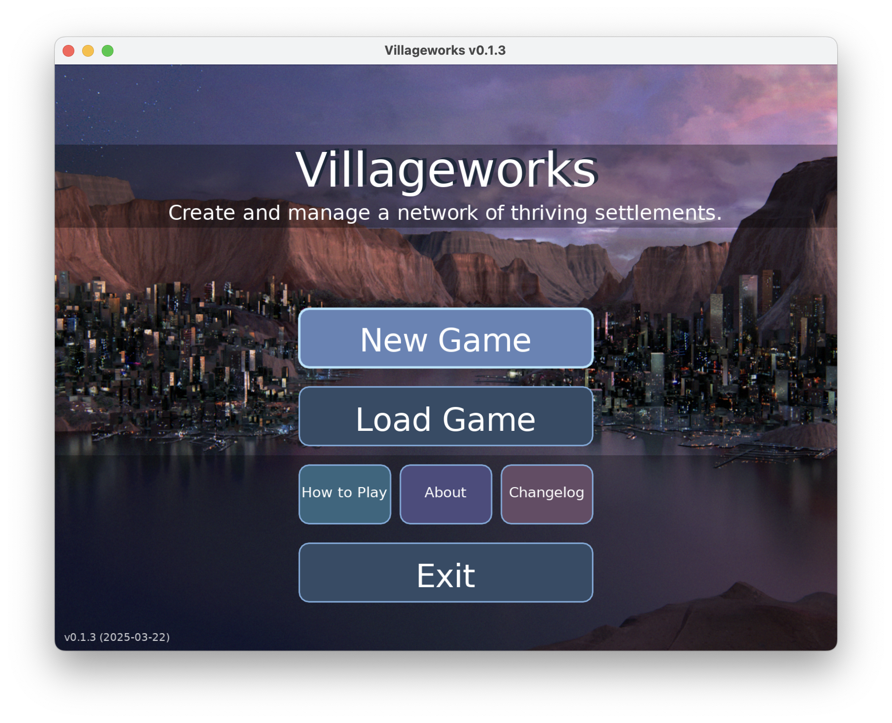
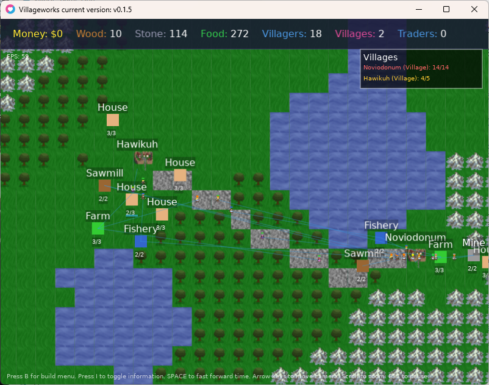

# Villageworks

Villageworks is an in-development open source civilization management game where you create and manage a network of thriving settlements, written in Lua using the LÖVE game engine. Current version: 0.1.4.

## Screenshots

Main menu: 

Gameplay: 

## Demo Videos

- Villageworks v0.1.4 Game Demo - Building Three Thriving Villages: <https://youtu.be/faGrqHzCRyM>.
- Villageworks In-Dev Building Farms: <https://youtu.be/haXjfGwkz2E>
- Villageworks growth of Carthage Demo: <https://youtu.be/PIl3rFCVl0s>
- Villageworks In-Dev Demo: <https://youtu.be/5IYsQdmNwtY>
- Villageworks Initial Dev Demo: <https://youtu.be/KV8QX6YbN38>

## Game Overview

Villageworks is a management simulation where you take on the role of a benevolent overseer guiding the development of a human civilization. Create multiple villages bearing procedurally-generated historical names, construct buildings strategically to access the procedurally generated mountain, water, forest areas, establish resource production chains, and connect your settlements with road networks to build a thriving inter-village trading society.

## Key Features

- **Settlement System**: Create multiple villages, each with a unique historical name
- **Procedurally Generated**: Cellular automata to generate landscapes and historical names selected from for village names
- **Autonomous AI**: Villagers and traders make their own decisions based on current needs and priorities
- **Resource Economy**: Strategic management of food, wood, stone, and money currency
- **Road Planning**: Plan and build roads to connect villages and enhance resource transport
- **Dynamic Growth**: Watch as villages develop organically based on resource availability and population needs
- **Save & Load**: Preserve your progress with a complete game state saving system
- **Visual Indicators**: Color-coded visual feedback helps quickly identify settlement needs

## Installation

### Requirements

- [LÖVE](https://love2d.org/) 11.3 or newer: the game engine
- This project: the game

### Running the Game

1. Download or clone this repository
2. Run the game using the LÖVE game engine:
   - **Windows**: Drag the repository folder onto love.exe or use `"C:\path\to\love.exe" "C:\path\to\villageworks"`
   - **macOS**: Use `open -n -a love "path/to/villageworks"` or drag the folder onto the LÖVE application
   - **Linux**: Use `love /path/to/villageworks`

### Building the Game

Builds the project to a single file that LÖVE can run.

1. Download or clone this repository
2. Navigate to the folder and run `zip -9 -r ../villageworks.love ./*`.
3. Go one folder up and run `love villageworks.love`

## Gameplay Guide

### Getting Started

1. From the main menu, select "New Game" to begin
2. Click anywhere on the map to place your first village (costs $50 and 20 wood)
3. Villages automatically spawn builders who will construct buildings
4. Builders prioritize houses to maintain population growth
5. Use the build menu to construct resource production buildings and plan roads

### Controls

- **Left Mouse Button**: Place villages, select villages, interact with UI
- **Right Mouse Button**: Deselect current village, cancel build mode
- **Arrow Keys**: Move the camera
- **Mouse Wheel**: Zoom in/out
- **B Key**: Open/close build menu
- **1-9 Keys**: Quickly select villages by index
- **Escape**: Access pause menu, close open dialogs
- **F5**: Quick save your game

### Game Mechanics

#### Villages

- Each village has a unique historical name
- Villages spawn builders if food is available
- Villages track their own population, resources, and building needs
- Housing needs are shown by village color (green, orange, or red)

#### Buildings

| Building   | Function | Resources Produced |
|------------|----------|-------------------|
| House      | Increases population capacity and spawns villagers | - |
| Farm       | Produces food | Food |
| Mine       | Extracts stone | Stone |
| Sawmill | Harvests wood | Wood |
| Fishery| Catches fish | Food |
| Market     | Conducts trader work | Money |

#### Resource System

- **Food**: Required to spawn builders and maintain population
- **Wood**: Used for construction of all buildings
- **Stone**: Used for construction of more advanced buildings
- **Money**: Earned from resource production and trade

#### Roads

- Roads connect villages to each other and to resource buildings
- Villagers and builders move faster on roads
- Roads improve resource transport efficiency
- Roads must be planned and built by builders

#### Saving and Loading

- Quick save with F5
- Save games with custom names through the pause menu
- Load saved games from the main menu
- Maps and all entity data are preserved between saves

Save games are saved by timestamp in the location dependent on your OS, listed in this [table](https://love2d.org/wiki/love.filesystem).

## Technical Architecture

### Game Structure

- Built with the LÖVE framework (Love2D)
- Modular Lua codebase with entity-based architecture
- Event-driven update system
- Complete serialization system for game state persistence

### Project Structure

```txt
villageworks/
├── config.lua       # Game constants and settings
├── utils.lua        # Utility functions
├── camera.lua       # Camera controls and viewport
├── ui.lua           # Main UI coordinator
├── ui/              # Modular UI components
│   ├── buildmenu.lua      # Building menuing
│   ├── documentation.lua  # Documentation system
│   ├── mainmenu.lua       # Main menu interface
│   ├── roads.lua          # Roads drawing system
│   ├── saveload.lua       # Save/load functionality
│   └── tooltip.lua        # Tooltip overlays
├── main.lua         # Entry point and game loop
├── map.lua          # Map generation and rendering
├── version.lua      # Version tracking
├── worldgen.lua     # World generation
├── lib/
│   └── serpent.lua  # Serialization library
├── data/
│   ├── village_names.lua  # Historical village names
│   ├── background.png     # Menu background
│   ├── main_menu.png      # Main menu screenshot
│   └── tiles.png          # Tileset graphics
├── docs/            # Documentation files
│   ├── GAME_GUIDE.md      # How to play guide
│   ├── ABOUT.md           # About the game
│   └── CHANGELOG.md       # Version history
├── saves/           # Directory for saved games
└── entities/
    ├── village.lua    # Village entity
    ├── trader.lua     # Trader entity
    ├── building.lua   # Buildings
    ├── villager.lua   # Villager entity
    └── road.lua       # Road system
```

## Future Plans

- Boat units
- Make traders use A* pathfinding
- Seasons and weather
- Enhanced villager behavior
- Village economy management
- Research and technology progression
- Custom map creation
- Village specialization
- Achievements and challenges

## License

This project is licensed under the MIT License, see the [LICENSE](./LICENSE) file for details.

## Acknowledgements

- Using the [LÖVE](https://love2d.org/) game engine available under the zlib/libpng license.
- Using the [Serpent](https://github.com/pkulchenko/serpent) Lua serializer available under the MIT License.
- Tilesets, music, and artwork used which are available for public usage under public domain Creative Commons licenses:
  - Grass, water, road tiles [Simple Tiles](https://opengameart.org/content/simple-tiles)
  - Tree tile [32x32_Tree](https://opengameart.org/content/32x32tree)
  - Main menu background art [City In A Canyon](https://opengameart.org/content/city-in-a-canyon)
  - Mountain tile [Tiny Basic 16 Tiles](https://opengameart.org/content/tiny-16-basic)
  - Main menu music [Hero Immortal](https://opengameart.org/content/hero-immortal)
  - Menu hover sfx [8bit Menu Highlight](https://opengameart.org/content/8bit-menu-highlight)
  - Menu select sfx (unused currently) [8bit Menu Select](https://opengameart.org/content/8bit-menu-select)

---

*For issues (first check if known already in ./docs/BUGS.md) or to submit feedback, please submit through GitHub issues.*
